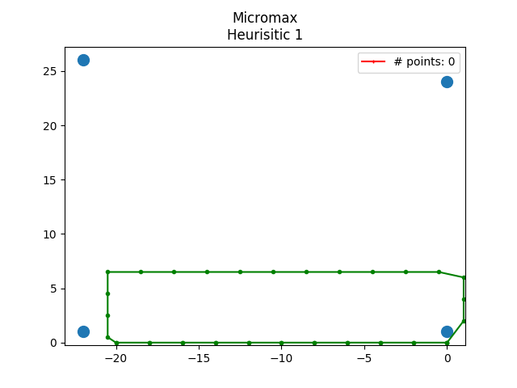
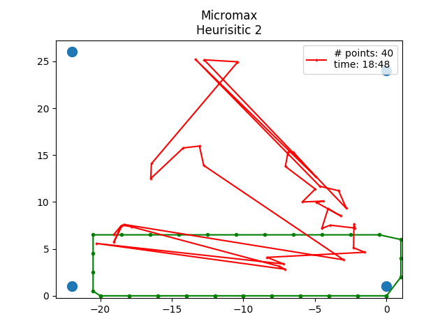
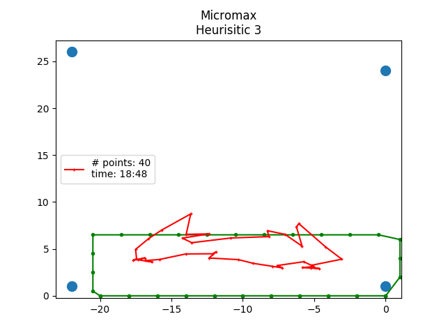

# The Task
- Localization of mobile devices based on probe requests received at Access points
- Long Term Goal - Simultaneous localisation of multiple devices, for analytics
- Probe requests - Any wifi enabled device sends frame requesting information regarding  all access points in the area
- Each probe request contains: MAC id of the device, timestamp, signal strength
- Not necessary for the mobile device to be connected to AP. Only wifi scanning should be on

# Approaches
## a) Heuristics

- **Heuristics 1**
  	1. Output centroid of intersection of 3 or more circles.
  	2. No point returned if less than 3 circles intersect.
  	
- **Heuristic 2**
	1. if 3 or more circles intersect, output centroid of intersection
	2. else take all intersections of 2 circles and output weighted centroid of centroid of intersections
  	

- **Heuristics 3**
  	1. if 3 or more circles intersect, output centroid of intersection.
  	2. else if less than 3 circles intersect take weighted centroid of centers of all circles.
  	3. Weight - inverse of radius of corresponding circles.
  	

