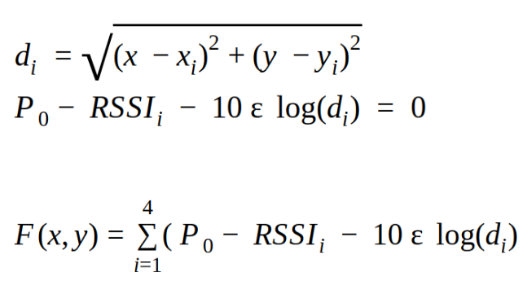
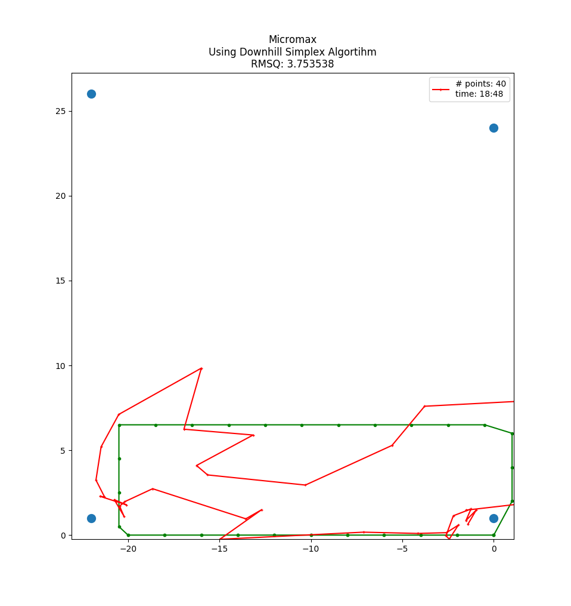
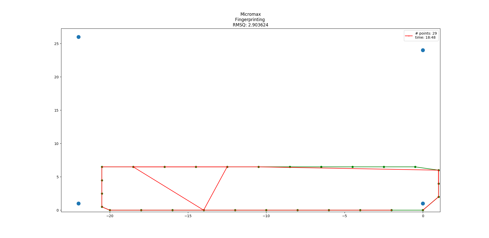
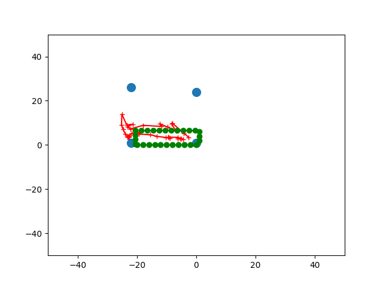

# The Task
- Localization of mobile devices based on probe requests received at Access points
- Long Term Goal - Simultaneous localisation of multiple devices, for analytics
- Probe requests - Any wifi enabled device sends frame requesting information regarding  all access points in the area
- Each probe request contains: MAC id of the device, timestamp, signal strength
- Not necessary for the mobile device to be connected to AP. Only wifi scanning should be on

# Approaches
## a) Heuristics

- **Heuristics 1**
  	1. Output centroid of intersection of 3 or more circles.
  	2. No point returned if less than 3 circles intersect.
  	
- **Heuristic 2**
	1. if 3 or more circles intersect, output centroid of intersection
	2. else take all intersections of 2 circles and output weighted centroid of centroid of intersections
  	

- **Heuristics 3**
  	1. if 3 or more circles intersect, output centroid of intersection.
  	2. else if less than 3 circles intersect take weighted centroid of centers of all circles.
  	3. Weight - inverse of radius of corresponding circles.
  	

## b) Downhill Simplex Algorithm

- Let (x, y) be the current coordinates of the mobile device. 
- (xi, yi) coordinates of the ith AP.
- All the three previous approaches tried to find the position of the device geometrically based on the distance calculated.
- Find the optimum value of x and y that minimize the value of F(x, y) using the Downhill Simplex Algorithm.

	

## c) Fingerprinting
- Offline Work to create Fingerprinting Database
	- Record the signal strength of probes received at several points by each Access Point.
	- Store this information in a database along with the known coordinates of the client device.

- Online Tracking Phase
	- The current RSSI vector at an unknown location is compared to those stored in the fingerprint.
	- The closest match is returned as the estimated user location.
	- Closest: smallest euclidean distance between RSSI vectors.

	

## d) Unsupervised HMM - Using HMMLearn Library
- Observed State - RSSI values; Hidden State - Location (X, Y)
- Multinomial HMM - discretized state space, discretized observations.
- Problem - State Space : Grid map across store. ~4000 states.
- RSSI discretized to (-30, -31…-99). Tuple of 4 RSSIs implies 704 = ~24 M parameters!
- Too many parameters, training time excruciatingly large

## e) Unsupervised HMM - implementation from scratch
- Gaussian Emission Probabilities, Gaussian Transition Probabilities (State space still discretized) # of parameters reduced to 20
- However, # of possible states still ~4000
- Hard EM (Using Viterbi) used for training - Time = O(Y2T); Y: # of states, T : sequence length
- Due to so many states, single step of EM - 55 hours! 
- HMM  - always discretized state space. Can’t reduce size of state space without losing accuracy
- Therefore, we turn to continuous state space modelling, aka Kalman Filters

## f) Kalman Filters
- Kalman Filters - estimating continuous state variables, with noisy observations over time
- Continuous - no nasty quadratic dependence on state space size;
- Training time linear in sequence size
- Problem - Observations : RSSI values.  State Variables : Location
- Fundamentally different quantities. How to associate the two?
- Possible Solution : Convert RSSI to distance, apply Kalman filter, then triangulate

	

# Future Work: Extended/Unscented Kalman Filters
- Kalman Filter assumes that the emission = affine transformation of hidden state + Gaussian Noise.
  Hidden State: correct distances
  Observed State: noisy distances (calculated from RSSIs)

- But with extended/unscented Kalman Filters we can model 
  Emission = non-linear transformation of hidden state + Gaussian Noise
  We can then have - Hidden States: Coordinates, Observed States = RSSI values

- This should give better results as now we don’t need to do triangulation to find the coordinates, the hidden states are the coordinates.
